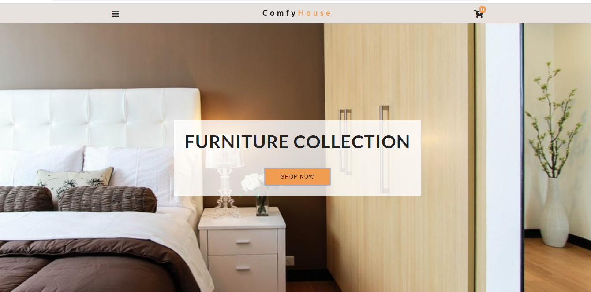
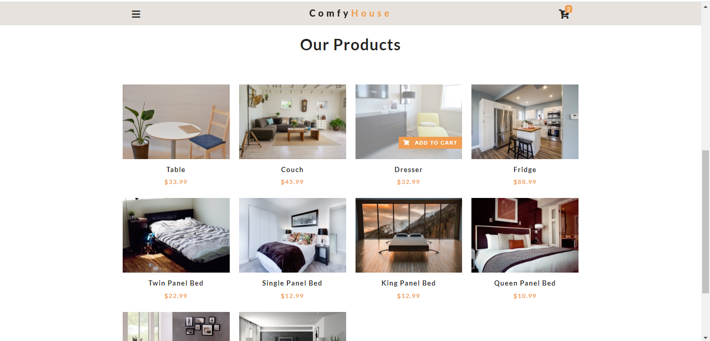
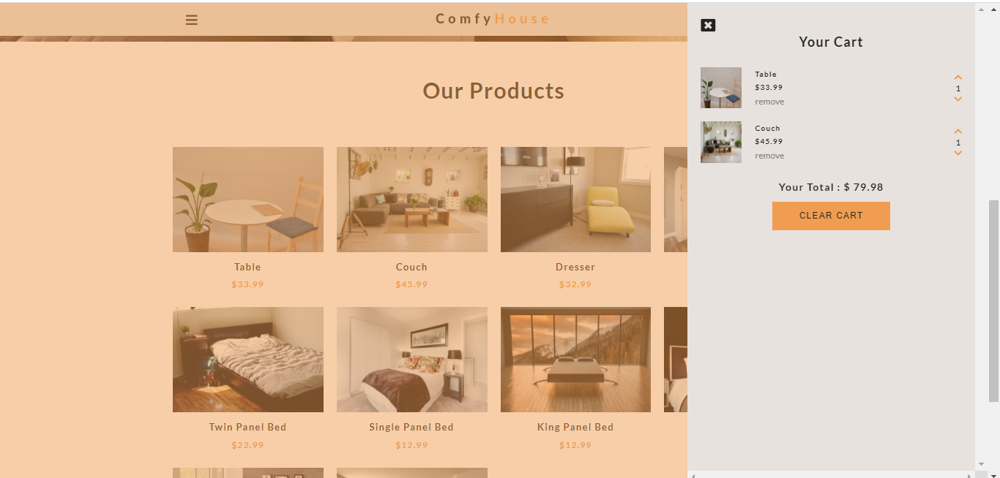

# Comfy-House Website
## A simple JS Shopping Cart Website. The project was built using vanilla.js and custom CSS.
### The website don't use any frontend Frameworks or libraries like React.js or jQuery or Bootstrap.
### The project uses Local Storage to save cart items. The project uses ES6 classes and objects.
### The products were loaded from products.json file during development and later from Contentful(A headless CMS) dynamically.

## HomePage - Brand Section: 

## HomePage - Products Section: 

## HomePage - Cart Section: 

## Live Demo
_github link_  https://shivraj97.github.io/comfy_house

